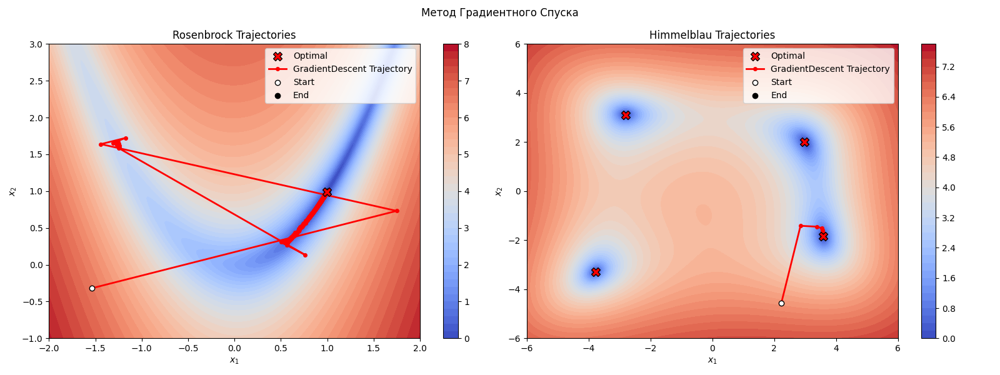
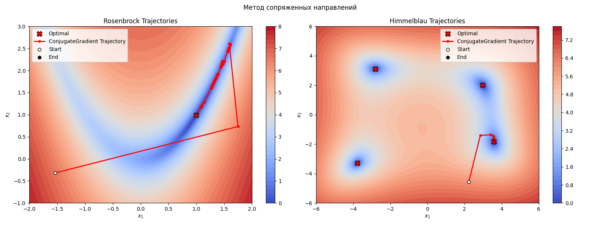
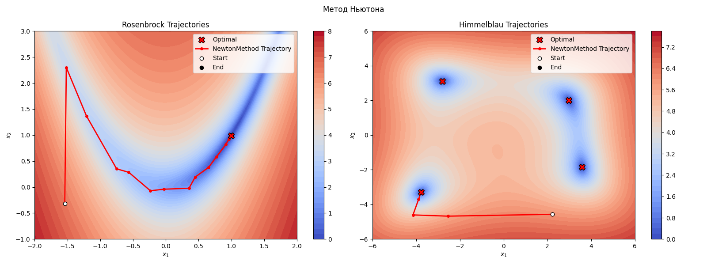

# Методы оптимизации

---

Этот проект демонстрирует работу трёх классических методов оптимизации:
- Метод градиентного спуска
- Метод сопряжённых градиентов
- Метод Ньютона

На примере двух «тестовых» функций: Розенброка и Химмельблау. Результаты отображаются в виде контурных графиков с траекториями поиска минимума.

## Пример работы

---





## Структура проекта

---

```
├── packages               # Основные модули
│   ├── config.py          # Параметры (шаги, допуски, количество итераций)
│   ├── functions.py       # Реализация функций Розенброка и Химмельблау
│   ├── helpers.py         # Утилиты: отрисовка поверхности, запуск алгоритма
│   └── optim.py           # Базовый класс Optimizer и три метода
├── main.py                # Точка входа: запускает все алгоритмы и строит графики
└── requirements.txt       # Зависимости проекта
```

## Как запустить

---

1. Склонируйте репозиторий и перейдите в папку проекта:
   ```bash
   git clone <URL>
   cd <папка проекта>
   ```
2. Создайте виртуальное окружение и установите зависимости:
   ```bash
   python -m venv venv
   source venv/bin/activate   # Windows: venv\Scripts\activate
   pip install -r requirements.txt
   ```
3. Запустите пример:
   ```bash
   python main.py
   ```

В терминале вы увидите прогресс и итоговые значения. А в графическом окне — контурные карты с красными линиями, показывающими, как алгоритмы шли к минимуму.

## Настройки параметров

---

Все параметры оптимизаторов собраны в `packages/config.py`: ша­говые множители, сжатие при backtracking, критерии остановки и частота логирования. Если хотите поэкспериментировать, просто поправьте словари:
```python
GRADIENT_DESCENT_RB_PARAMS = {
    'max_iter': 2e5,          # максимальное число итераций
    'logging_steps': 100,     # каждые 100 шагов выводить прогресс
    'backtrack_alpha': 1e-3,  # стартовый шаг
    'backtrack_lambda': 0.5,  # коэффициент сжатия
    'backtrack_eps': 1e-4,    # параметр Армиджо
    'delta': 1e-8             # точность по норме градиента
}
```
Аналогичные словари есть для всех сочетаний метода + функции.

## Как добавить свои функции или методы

---

- **Новая функция**: в `packages/functions.py` создайте класс-наследник от `_Function` и реализуйте:
  - `_compute_item(x)` — значения функции
  - `_compute_grad(x)` — градиент
  - `_compute_hess(x)` — (опционально) гессиан

- **Новый оптимизатор**: в `packages/optim.py` унаследуйтесь от `_Optimizer` и реализуйте методы `_backtracking()` (line search) и `_step()` (обновление). При необходимости, можно добавлять/удалять/изменять аттрибуты и методы.

## Используемые библиотеки

---

Указаны в `requirements.txt`.
